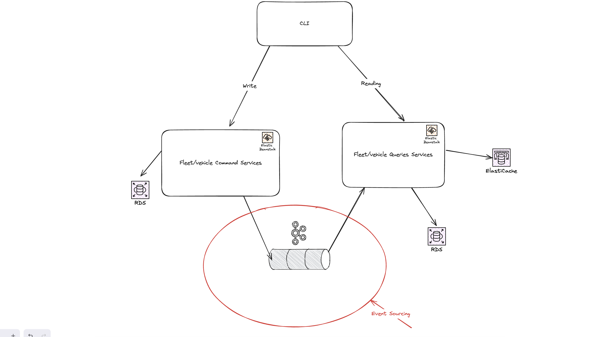

# Question 1

For code quality, you can use some tools : which one and why (in a few words) ?

- The first one I think it's SonarQube for detect potential technical debt in a project or security issues

- And the second one I think it's ESlint for detect some syntax error or help to follow certain language rules

# Question 2

you can consider to setup a ci/cd process : describe the necessary actions in a few words

When you commit the CI is launch start by :

- Quality Checks (Sonar for example if < 80% Coverage failed Or ESLint checks for quality of code style).

- Set up docker environnement (npm install etc ...).

- Testing (We can separate testing in 2 phase: Unit Testing like Jest, Mocha and after E2E/Integration with cucumber,cypress,...).

- Building/Create artifact (for deployment).

- Optional : Generate Rapport / Send Messages on slack, teams, discord.

- Deployment (with Terraform or CloudFormation in AWS / maybe Ansible too).

# TO GO DEEPER

This section is here because I enjoy exploring potential evolutions of the back-end. Due to time constraints, I can't provide a perfect implementation, but I like to discuss and imagine possible architectural approaches. 

To fully leverage the CQRS pattern, we can use Kafka as an event store to implement event sourcing, ideally within a microservices architecture, as illustrated in the diagram. The choice of RDS is also deliberate; it aligns with a preference for Consistency over Availability in the CAP Theorem. For such systems, an ACID-compliant database is, in my opinion, the right choice.

Additionally, I incorporated a cache using a cache-aside pattern. As the system scales, it's reasonable to assume that frequently accessed data—such as the location of the most recently parked car—can benefit from caching to improve response times and system performance.